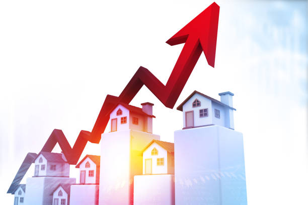

# House Sales Analysis In A NorthWestern County
Aurthor: MARTIN NGUGI.

# BUSINESS OVERVIEW
The real estate agency helps homeowners buy and/or sell homes. One of the key services they provide is advice to homeowners about how home renovations can increase the estimated value of their homes. The agency is interested in developing a model that can predict the estimated value of a home after renovations, based on the type and cost of the renovations.

# BUSINESS PROBLEM
The real estate agency needs to provide accurate advice to homeowners about how home renovations can increase the estimated value of their homes, and by what amount. However, the agency currently lacks a reliable method for predicting the impact of specific home renovations on home value. As a result, the agency is unable to provide accurate advice to homeowners about the potential return on investment for different renovation projects.

## Metrics of Success
I decided to opt for RMSE as our metric of success because it is measured in the same units as the response variable.

The project objectives we aim to solve include:

1. To identify features influencing the pricing.

2. To analyse trends in house prices over time (time series analysis) and predict future prices.

3. To identify undervalued properties (outlier detection) and recommend better pricing strategies.

# DATA UNDERSTANDING
In completing this analysis, I did not use any additional datasets as what had been provided by the stakeholders was adequate for the level of analysis I was carrying out.

Additionally, I created functions to support in our data understanding.

The columns in the dataset are outlined below:

## Column Names and Descriptions for the DataSet
id - Unique identifier for a house

date - Date house was sold

price - Sale price (prediction target)

bedrooms - Number of bedrooms

bathrooms - Number of bathrooms

sqft_living - Square footage of living space in the home

sqft_lot - Square footage of the lot

floors - Number of floors (levels) in house

waterfront - Whether the house is on a waterfront

view - Quality of view from house

condition - How good the overall condition of the house is. Related to maintenance of house.

grade - Overall grade of the house. Related to the 
construction and design of the house.

sqft_above - Square footage of house apart from basement

sqft_basement - Square footage of the basement

yr_built - Year when house was built

yr_renovated - Year when house was renovated

zipcode - ZIP Code used by the United States Postal Service

lat - Latitude coordinate

long - Longitude coordinate

sqft_living15 - The square footage of interior housing living 
space for the nearest 15 neighbors

sqft_lot15 - The square footage of the land lots of the 
nearest 15 neighbors

# DATA CLEANING AND PREPARATION
- Cleaned the Data::

         * Dropped duplicate values
         * Dropped missing values
- Formatted the Data:

         * Changed datatype formats as needed

# DATA ANALYSIS
Objective 1: Here, we analysed how other factors such as number of bedrooms,square feet living,conditions among other variables provided in the dataset can influence the price of a house

Objective 2: Under this section, we looked at the columns year built, date sold (including month sold and year sold) as well as the age of the property as factors that would influence the price. We used a linear regression and a multiple linear regression model to do this.

Objective 3: In this section, we analyse the outliers in price category. We identify the houses with extremely high and low prices, and try to find out the reason for it. We also suggest a better pricing strategy.

# DATA MODELLING
In addressing the different objectives I chose appropriate models (Multiple linear regression) that would help us to achieve them.

# Conclusion
1. Some of the features that influence the pricing of houses include:

    a. Square footage of living space in the home: an additional square footage increases the
       price by $199.09

    b. Waterfront: the presence of a waterfront has an associated increase in price of $70,000

    c. Condition of the house: houses in good conditions have an associated increase in price of
       $35,650 compared to houses with average condition.

    d. For every additional year in the age of a house, there is an associated decrease in price of$626.09

    e. Some of the overvalued properties were found to be older than 50 years of age
    
    f. The square footage of interior housing living space for the nearest 15 neighbors influencesthe pricing of houses, in that, an additional square   footage leads to an increse in price by$48.35  

# Recommendations
I recommend that:

1. There is a need to do further exploration into other features in order to better understand thedeterminants of house prices.

2. The agency should consider re-purposing the old houses and targeting business owners ratherthan homeowners, this may also be achieved by market research.

3. The agency should consider investing in properties that can increase their profitability, such asproperties that have a waterfront.